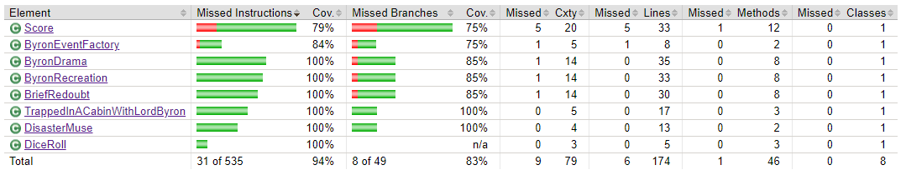

# Trapped in a cabin with Lord Byron

This repository used to contain an implementation of the famous [Trapped in a cabin with Lord Byron](Rules.md) game by Oliver Darkshire.

But sometimes, bad things happens, like using a `rm -rf .` command at root directory, or inputting a lot of commands without checking the results...
In our case, a dreadful `push -f` was done after a messy combination of bad recursive deletions, and all source code was lost.
Attempts were made to recover what was salvageable but alas, the save file was also corrupt, and we could not recover anything...

That was what we thought after we saw the corruption error on the screen after 3 hours of trying to understand how to unpack a `tar.gz`. And then we realized that the tests were still there !

Your mission is simple : save us and recreate the code that matches the tests ! (because we are not trusted to touch a keyboard ever again)

## Rules
There are not a lot of rules here, so please respect it.

### Rule #1 : No change inside test code
You shall not change/alter/modify existing tests.
You cannot add new tests until **everything** is green.

Those tests where working perfectly fine, be grand they exist and guide you !

### Rule #2 : Implement things one test at a time
You shall not try to implement everything at once !
The code was made using TDD, you are expected to do the same.
Implement things one test at a time.

And implement it the **dumbest** way possible.

And be grand, someone already wrote the tests for you !

### Rule #3 : Commit everytime a test go green
Commit often, say what you did in your commit message.

### Rule #4 : Implement only what is described in the tests
Tests give you a full vision of what the classes you create should look like. Don't add more methods than strictly necessary. And don't add classes or interfaces that are not described in the tests !

Don't you dare add getters everywhere !

### Rule #5 : Final coverage should be at least at good as the previous one
This is the previous test coverage report :

Your code should have a better score that this because *someone* had the audacity to put a `toString()` method in `Score` and did not test it !
(note that this issue only happened in the Java word. The C# word achieved 100%)

## What to do now ?
Choose your path carefully adventurer : 
- You can venture into the forest to find the [Java version](java/Readme_TheJavaVersion.md)
- You can venture into the dungeon to find the [C# version](Csharp/Readme_TheCSharpVersion.md)